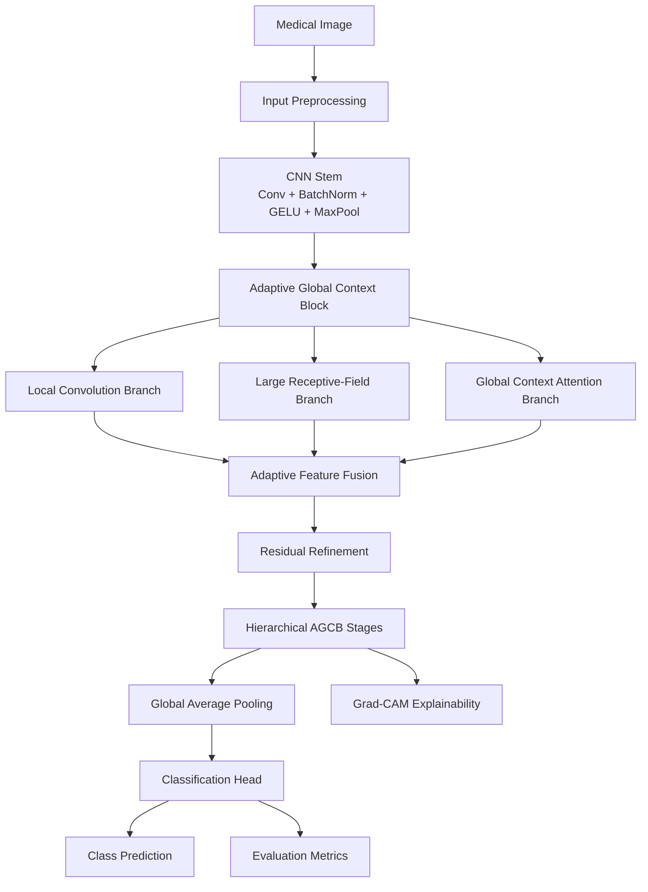
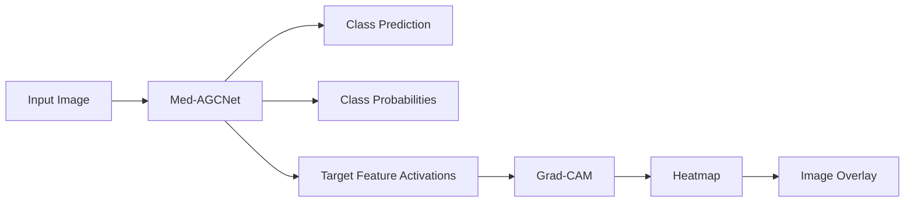

<div align="center">

# Med-AGCNet

### Adaptive Global Context Network for Medical Image Classification

**Deep Learning · Medical Imaging · Computer Vision · Explainable AI · PyTorch**

A research-oriented deep learning framework that combines **local features, large receptive-field information, and global contextual representations** through adaptive feature fusion.

[Overview](#overview) • [Architecture](#high-level-architecture) • [Results](#reference-results) • [Quick Start](#quick-start) • [Usage](#usage) • [Reproducibility](#reproducibility)

</div>

---

## Overview

**Med-AGCNet** is a convolutional neural network architecture for medical image classification built around the **Adaptive Global Context Block (AGCB)**.

The model is designed to capture complementary information at multiple spatial scales:

- Fine-grained local visual patterns
- Wider spatial relationships
- Global contextual dependencies

These representations are dynamically combined using an adaptive fusion mechanism and refined through residual learning.

The repository provides a complete research workflow for:

- Model training
- Validation and testing
- Classification-threshold optimization
- Baseline comparison
- Ablation studies
- Class-imbalance handling
- Grad-CAM explainability
- Metric and figure generation
- Experiment reproducibility
- Single-image inference
- Research-report generation

---

## Key Capabilities

### Model Architecture

- Custom PyTorch implementation
- Adaptive Global Context Blocks
- Multi-branch feature extraction
- Local convolutional modeling
- Large receptive-field modeling
- Global context attention
- Adaptive feature fusion
- Residual refinement
- Hierarchical representation learning

### Training

- AdamW optimization
- Learning-rate scheduling
- Automatic Mixed Precision
- Gradient clipping
- Early stopping
- Best-checkpoint selection
- CPU, CUDA, and Apple MPS support
- Deterministic experiment mode
- Reproducible random seeds

### Evaluation

The pipeline supports:

- Accuracy
- Balanced Accuracy
- Precision
- Recall
- F1-Score
- Weighted F1
- Macro F1
- Sensitivity
- Specificity
- Matthews Correlation Coefficient
- ROC-AUC
- PR-AUC
- Confusion Matrix

### Explainability

Grad-CAM inference can generate:

- Predicted class
- Class probabilities
- Confidence score
- Inference time
- Activation heatmap
- Image overlay
- Prediction metadata

---

# High-Level Architecture



The architecture avoids relying on a single receptive-field scale.

Each AGCB extracts complementary representations and combines them adaptively before forwarding refined features to the next stage.

---

## Adaptive Global Context Block

The **Adaptive Global Context Block** is the central architectural component of Med-AGCNet.

### Local Convolution Branch

Captures fine-grained spatial patterns and local texture information.

This branch preserves detailed features that may be important for discriminating subtle medical-image characteristics.

### Large Receptive-Field Branch

Captures broader structural relationships by expanding the effective receptive field.

This allows the network to model information extending beyond small local neighborhoods.

### Global Context Attention Branch

Aggregates global information across the feature map to capture long-range contextual dependencies.

### Adaptive Fusion

The three feature streams are dynamically combined through a learned fusion mechanism:

```text
Local Features ───────────────┐
                              │
Large-RF Features ────────────┼──► Adaptive Fusion ──► Residual Refinement
                              │
Global Context Features ──────┘
```

Residual refinement preserves the original representation while improving information flow through the architecture.

---

## Research Workflow


Threshold selection is performed using validation data before final test evaluation.

The test set is reserved for final performance assessment.

---

# Reference Results

The best recorded Med-AGCNet experiment on **PneumoniaMNIST** achieved:

| Metric | Result |
|---|---:|
| **Test Accuracy** | **92.47%** |
| **Balanced Accuracy** | **90.98%** |
| **Weighted F1** | **92.38%** |
| **ROC-AUC** | **0.9758** |
| **Decision Threshold** | **0.57** |

### Dataset Split

| Split | Samples |
|---|---:|
| Training | 4,708 |
| Validation | 524 |
| Test | 624 |

These values correspond to the recorded reference experiment and should be interpreted within its specific dataset, configuration, and evaluation protocol.

> **Important:** These results represent research performance and must not be interpreted as clinical diagnostic performance or clinical validation.

---

## Supported Dataset Formats

### PneumoniaMNIST NPZ

The implementation directly supports PneumoniaMNIST-style `.npz` datasets containing:

```text
train_images
train_labels
val_images
val_labels
test_images
test_labels
```

Example:

```text
pneumoniamnist.npz
```

Grayscale images are converted to three-channel representations for compatibility with the model pipeline.

---

### ImageFolder

Custom datasets can also follow the standard PyTorch `ImageFolder` structure:

```text
dataset/
├── train/
│   ├── class_0/
│   └── class_1/
├── val/
│   ├── class_0/
│   └── class_1/
└── test/
    ├── class_0/
    └── class_1/
```

Class names are inferred automatically from the directory structure.

---

## Class-Imbalance Handling

Medical datasets frequently contain unequal class distributions.

Med-AGCNet supports:

```text
none
weighted_loss
weighted_sampler
both
```

The default configuration uses:

```text
weighted_loss
```

This allows the training workflow to account for class imbalance without altering the underlying dataset.

---

## Classification-Threshold Optimization

Binary classification performance can depend substantially on the decision threshold.

Instead of always assuming:

```text
0.50
```

the validation pipeline can search automatically for a better operating threshold.

Supported objectives include:

```text
balanced_accuracy
f1
```

The selected validation threshold is then used for final test evaluation.

The test set is not used for threshold optimization.

---

## Baseline Models

The research pipeline supports comparison against multiple reference architectures:

| Model | Role |
|---|---|
| `SimpleCNN` | Lightweight convolutional baseline |
| `ResNet-18` | Residual CNN baseline |
| `EfficientNet-B0` | Efficient modern CNN baseline |
| `Med-AGCNet` | Proposed architecture |

Baseline experiments can compare:

- Accuracy
- Balanced Accuracy
- Precision
- Recall
- F1-Score
- Parameter count
- Runtime

This provides a consistent framework for evaluating Med-AGCNet against established CNN architectures.

---

## Ablation Study

Multiple architecture variants are available for component-level analysis:

| Variant | Description |
|---|---|
| `med_agcnet_full` | Complete architecture |
| `med_agcnet_no_global` | Removes Global Context Attention |
| `med_agcnet_no_large_rf` | Removes large receptive-field modeling |
| `med_agcnet_no_fusion` | Replaces adaptive feature fusion |
| `med_agcnet_local_only` | Retains only local feature modeling |

These experiments help quantify the contribution of individual architectural components.

---

## Explainable AI with Grad-CAM

Med-AGCNet integrates **Gradient-weighted Class Activation Mapping** for qualitative model interpretation.



Grad-CAM helps identify image regions that most strongly influence a model prediction.

> Grad-CAM is an interpretability aid. It does not provide clinically validated lesion localization or causal explanation.

---

# Quick Start

## 1. Clone the Repository

```bash
git clone https://github.com/mahmmooudian/Med-AGCNet.git
cd Med-AGCNet
```

## 2. Create a Virtual Environment

### Windows

```bash
python -m venv .venv
.venv\Scripts\activate
```

### Linux / macOS

```bash
python3 -m venv .venv
source .venv/bin/activate
```

## 3. Install Dependencies

```bash
python -m pip install --upgrade pip
pip install torch torchvision numpy matplotlib pillow scikit-learn
```

## 4. Validate the Dataset

```bash
python med_agcnet_research.py \
    --mode validate \
    --data pneumoniamnist.npz
```

## 5. Train Med-AGCNet

```bash
python med_agcnet_research.py \
    --mode train \
    --data pneumoniamnist.npz \
    --model med_agcnet_full \
    --epochs 20 \
    --batch-size 32 \
    --lr 0.0001
```

---

# Usage

The research workflow is exposed through a command-line interface:

```bash
python med_agcnet_research.py --mode MODE [OPTIONS]
```

Supported modes:

```text
validate
train
evaluate
baseline
ablation
infer
report
all
```

---

## Device Selection

Automatic:

```bash
--device auto
```

CPU:

```bash
--device cpu
```

CUDA:

```bash
--device cuda
```

Example:

```bash
python med_agcnet_research.py \
    --mode train \
    --data pneumoniamnist.npz \
    --device cuda
```

---

## Evaluate a Trained Model

```bash
python med_agcnet_research.py \
    --mode evaluate \
    --data pneumoniamnist.npz \
    --checkpoint outputs_med_agcnet/runs/med_agcnet_full/best_model.pth
```

---

## Run Baseline Comparison

```bash
python med_agcnet_research.py \
    --mode baseline \
    --data pneumoniamnist.npz \
    --comparison-epochs 10
```

---

## Run Ablation Study

```bash
python med_agcnet_research.py \
    --mode ablation \
    --data pneumoniamnist.npz \
    --comparison-epochs 10
```

---

## Inference & Grad-CAM

```bash
python med_agcnet_research.py \
    --mode infer \
    --checkpoint outputs_med_agcnet/runs/med_agcnet_full/best_model.pth \
    --image sample_image.png
```

The inference workflow can generate:

- Predicted class
- Class probabilities
- Confidence score
- Inference time
- Grad-CAM visualization
- Prediction metadata

---

## Generate Research Report

```bash
python med_agcnet_research.py --mode report
```

The generated report is written as:

```text
RESEARCH_REPORT.md
```

---

## Run the Complete Pipeline

```bash
python med_agcnet_research.py \
    --mode all \
    --data pneumoniamnist.npz
```

The complete workflow can include:

```text
Training
   ↓
Evaluation
   ↓
Baseline Comparison
   ↓
Ablation Study
   ↓
Result Generation
   ↓
Research Report
```

---

## Configuration

| Argument | Description | Default |
|---|---|---|
| `--data` | Dataset path | `./pneumoniamnist.npz` |
| `--output` | Output directory | `./outputs_med_agcnet` |
| `--model` | Model architecture | `med_agcnet_full` |
| `--epochs` | Training epochs | `20` |
| `--comparison-epochs` | Baseline / ablation epochs | `10` |
| `--batch-size` | Batch size | `32` |
| `--image-size` | Image resolution | `224` |
| `--lr` | Learning rate | `1e-4` |
| `--weight-decay` | Weight decay | `1e-4` |
| `--seed` | Random seed | `42` |
| `--device` | Compute device | `auto` |
| `--imbalance-strategy` | Class-imbalance strategy | `weighted_loss` |
| `--fake-data` | Synthetic-data mode | Disabled |
| `--no-threshold-tuning` | Disable threshold optimization | Disabled |
| `--no-amp` | Disable mixed precision | Disabled |
| `--nondeterministic` | Disable deterministic execution | Disabled |
| `--pretrained-baselines` | Use pretrained baseline weights | Disabled |

---

## Generated Outputs

A complete experiment can generate:

```text
outputs_med_agcnet/
├── environment.json
├── runs/
│   └── med_agcnet_full/
│       ├── best_model.pth
│       ├── config.json
│       ├── metrics.json
│       ├── history.csv
│       ├── history.json
│       ├── test_predictions.csv
│       ├── classification_report.txt
│       ├── confusion_matrix.png
│       ├── training_loss.png
│       ├── training_accuracy.png
│       ├── roc_curve.png
│       └── pr_curve.png
├── comparisons/
│   ├── baseline/
│   └── ablation/
├── inference/
│   ├── image_prediction.json
│   └── image_gradcam.png
└── RESEARCH_REPORT.md
```

This structure makes experiments easier to inspect, compare, reproduce, and audit.

---

# Reproducibility

Reproducibility is treated as part of the experimental pipeline rather than as optional post-processing.

The implementation controls or records:

- Python random seed
- NumPy random seed
- PyTorch random seed
- CUDA random seed
- Deterministic execution settings
- Model configuration
- Training history
- Best checkpoint
- Environment metadata
- Test-set predictions
- Classification threshold

Default seed:

```text
42
```

---

## Synthetic Data Mode

Synthetic data can be used for software and pipeline validation:

```bash
python med_agcnet_research.py \
    --mode train \
    --fake-data \
    --epochs 1
```

> Synthetic-data results are intended only for software validation and must not be interpreted as medical or scientific evidence.

---

## Technology Stack

| Area | Technologies |
|---|---|
| **Language** | Python |
| **Deep Learning** | PyTorch |
| **Computer Vision** | Torchvision |
| **Machine Learning** | Scikit-learn |
| **Scientific Computing** | NumPy |
| **Visualization** | Matplotlib |
| **Image Processing** | Pillow |
| **Explainability** | Grad-CAM |
| **Acceleration** | CUDA / AMP |
| **Experiment Interface** | Command-line research pipeline |

---

## Project Structure

```text
Med-AGCNet/
├── CITATION.cff
├── LICENSE
├── README.md
└── med_agcnet_research.py
```

The current repository intentionally packages the complete experimental workflow in a single executable research implementation.

Experiment artifacts are generated separately during execution.

---

## Engineering & Research Principles

Med-AGCNet emphasizes:

- **Reproducibility** — controlled and recorded experimental conditions
- **Transparent evaluation** — multiple complementary classification metrics
- **Validation-first decisions** — threshold selection without test-set leakage
- **Explainability** — qualitative inspection through Grad-CAM
- **Baseline comparison** — evaluation against reference CNN architectures
- **Ablation analysis** — component-level investigation
- **Class-imbalance awareness** — explicit imbalance strategies
- **Experiment traceability** — saved configurations, checkpoints, predictions, and metrics

The objective is not only to train a classifier, but to provide a structured research workflow for investigating architectural design and model behavior.

---

## Limitations

Med-AGCNet is a research implementation and should be interpreted accordingly.

Current limitations include:

- Experimental performance is dataset-dependent.
- External clinical validation has not been performed.
- Prospective clinical evaluation has not been performed.
- Grad-CAM does not provide clinically validated lesion localization.
- Performance should not be generalized to other datasets or imaging modalities without additional validation.
- The repository is research-oriented rather than a production inference service.
- Regulatory validation has not been performed.

These limitations explicitly separate **experimental model performance** from **clinical applicability**.

---

## Roadmap

Planned or potential future work includes:

- Evaluation on additional medical-imaging datasets
- External validation
- Repeated-run statistical analysis
- Expanded architectural ablation
- Calibration analysis
- Additional explainability methods
- Model-efficiency benchmarking
- Modular research package
- Automated testing
- Continuous integration
- Packaged inference API
- Pretrained checkpoint release

---

## Citation

If you use Med-AGCNet in academic work, citation metadata is available in:

```text
CITATION.cff
```

Publication details will be updated after formal publication.

```bibtex
@article{medagcnet2026,
  title   = {Med-AGCNet: Adaptive Global Context Network for Medical Image Classification},
  author  = {Mahmoudian, Amir Mohammad},
  journal = {To be updated},
  year    = {2026}
}
```

---

## Disclaimer

This repository is intended for **research and educational purposes only**.

Med-AGCNet is **not a certified medical device** and must not be used directly for:

- Clinical diagnosis
- Treatment decisions
- Patient management
- Clinical triage

without appropriate clinical validation, expert oversight, and regulatory approval.

---

## Author

**Amir Mohammad Mahmoudian**

AI Engineer focused on **deep learning, computer vision, applied AI, and machine-learning systems**.

[GitHub](https://github.com/mahmmooudian) · [LinkedIn](https://www.linkedin.com/in/amirmohmmadmahmoudian)

---

## License

This project is released under the **MIT License**.

See [`LICENSE`](LICENSE) for details.

---

<div align="center">

### Deep Learning × Global Context × Explainable Medical AI

**Researching reliable and interpretable deep-learning systems for medical imaging.**

If this repository supports your work or research, consider giving it a ⭐.

</div>
